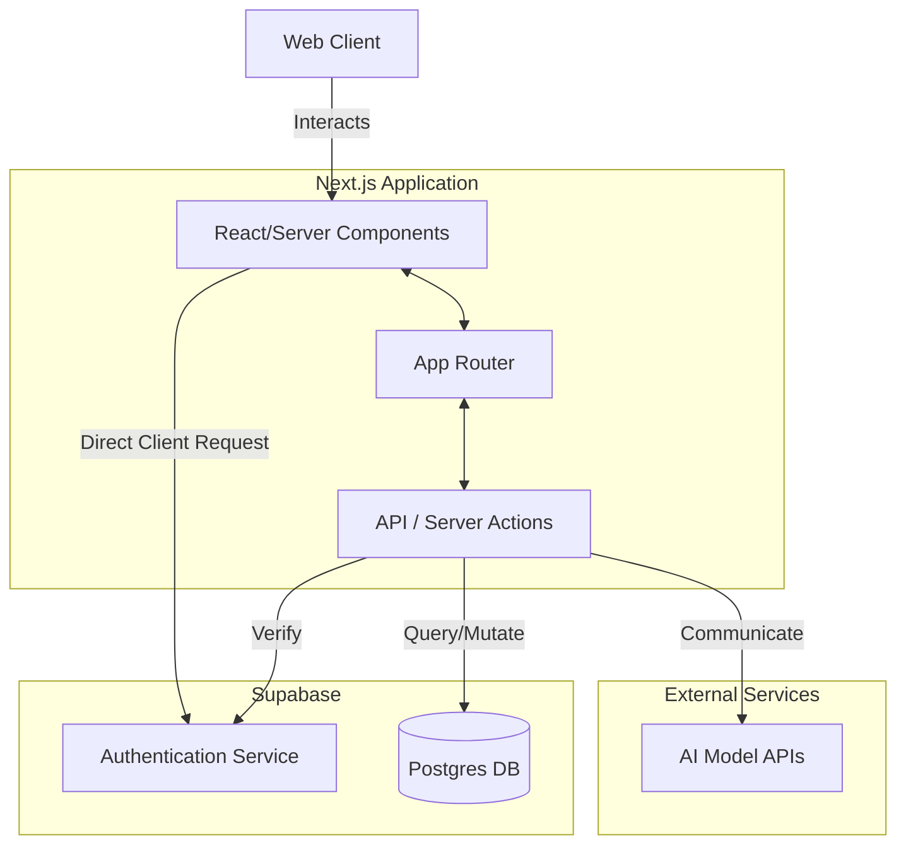
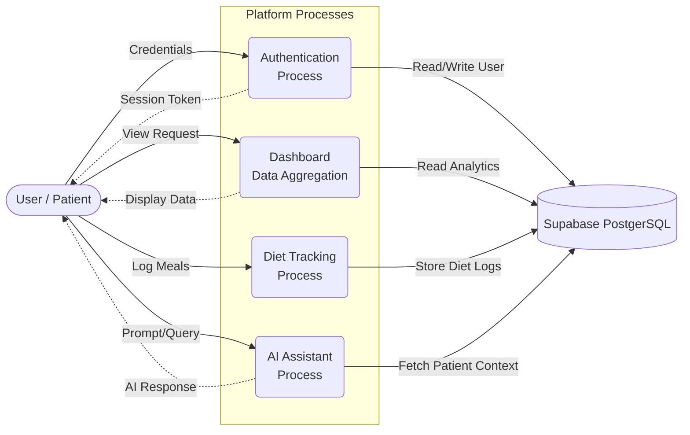

# CareBridge 

A comprehensive patient care coordination platform built with modern web technologies, designed to streamline healthcare management and improve patient outcomes.

## Tech Stack

- **Framework**: [Next.js](https://nextjs.org/) (App Router, React 19)
- **Styling**: [Tailwind CSS v4](https://tailwindcss.com/)
- **UI Components**: [Radix UI](https://www.radix-ui.com/), [Lucide React](https://lucide.dev/)
- **Animations**: [Framer Motion](https://www.framer.com/motion/)
- **Database & Auth**: [Supabase](https://supabase.com/)
- **Data Visualization**: [Recharts](https://recharts.org/)
- **Forms**: [React Hook Form](https://react-hook-form.com/) with [Zod](https://zod.dev/) validation

##  Features
- **Secure Authentication**: Powerful authentication via Supabase.
- **AI Assistant**: Intelligent chat interface for patient insights and queries (`/components/dashboard/assistant`).
- **Diet Tracker**: Comprehensive diet and nutrition tracking UI (`/components/dashboard/diet`).
- **Interactive Dashboard**: Real-time analytics and management interface.

##  System Architecture

The following diagram illustrates the high-level architecture of CareBridge system:



## 🔄 Data Flow Diagram (DFD)

This Data Flow diagram shows the flow of data within the system between external entities, processes, and data stores:



## 💻 Getting Started

First, install the dependencies:

```bash
npm install
# or
yarn install
# or
pnpm install
```

Then, run the development server:

```bash
npm run dev
# or
yarn dev
# or
pnpm run dev
```

Open [http://localhost:3000](http://localhost:3000) with your browser to see the result.
