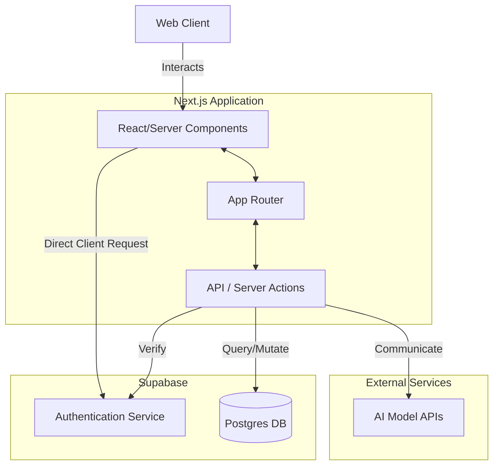
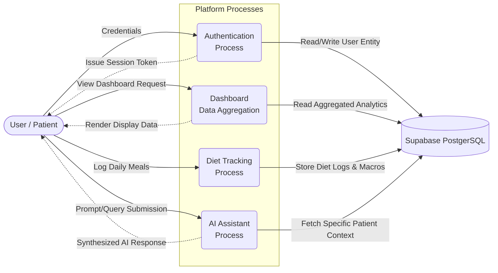

# CareBridge 

A comprehensive patient care coordination platform built with modern web technologies, designed to streamline healthcare management and improve patient outcomes.

## Tech Stack

- **Framework**: [Next.js](https://nextjs.org/) (App Router, React 19)
- **Styling**: [Tailwind CSS v4](https://tailwindcss.com/)
- **UI Components**: [Radix UI](https://www.radix-ui.com/), [Lucide React](https://lucide.dev/)
- **Animations**: [Framer Motion](https://www.framer.com/motion/)
- **Database & Auth**: [Supabase](https://supabase.com/)
- **Data Visualization**: [Recharts](https://recharts.org/)
- **Forms**: [React Hook Form](https://react-hook-form.com/) with [Zod](https://zod.dev/) validation

##  Features
- **Secure Authentication**: Powerful authentication via Supabase.
- **AI Assistant**: Intelligent chat interface for patient insights and queries (`/components/dashboard/assistant`).
- **Diet Tracker**: Comprehensive diet and nutrition tracking UI (`/components/dashboard/diet`).
- **Interactive Dashboard**: Real-time analytics and management interface.

##  System Architecture

The following diagram illustrates the high-level architecture of CareBridge system:



## Data Flow Diagram (DFD)

This Data Flow diagram shows the flow of data within the system between external entities, processes, and data stores:


## 💻 Getting Started

First, install the dependencies:

```bash
npm install
# or
yarn install
# or
pnpm install
```

Then, run the development server:

```bash
npm run dev
# or
yarn dev
# or
pnpm run dev
```
# CareBridge

CareBridge is a comprehensive patient care coordination platform built with modern web technologies, designed to streamline healthcare management, enhance communication between patients and providers, and ultimately improve patient outcomes through data-driven insights mapping.

## Tech Stack Overview

The application utilizes a fully decoupled architecture with a modern, server-rendered frontend connecting to a robust Backend-as-a-Service (BaaS).

- **Framework**: [Next.js](https://nextjs.org/) (Utilizing the App Router paradigm and React 19 for concurrent rendering)
- **Styling**: [Tailwind CSS v4](https://tailwindcss.com/) (For rapid, utility-first UI development and unified design tokens)
- **UI Architecture**: [Radix UI](https://www.radix-ui.com/) primitives combined with [Lucide React](https://lucide.dev/) iconography for accessible, rich user interfaces
- **Animation Engine**: [Framer Motion](https://www.framer.com/motion/) for fluid state transitions and micro-interactions
- **Database & Identity Provider**: [Supabase](https://supabase.com/) (PostgreSQL database with Row-Level Security, Auth, and Storage capabilities)
- **Data Visualization**: [Recharts](https://recharts.org/) (For plotting historical health metrics like blood pressure and weight trends)
- **Forms & Data Integrity**: [React Hook Form](https://react-hook-form.com/) strongly typed with [Zod](https://zod.dev/) validation schemas

## Core Features Breakdown

CareBridge is divided into several autonomous modules that cohesively support patient tracking:

- **Secure Authentication & Session Management**: Utilizing Supabase Auth, the platform provides secure credential tracking, JWT issuance, and protected route logic ensuring sensitive medical data is safe and correctly isolated per user via Postgres Row-Level Security (RLS).
- **AI Health Assistant Integration**: An intelligent, context-aware chat interface (`/components/dashboard/assistant`). This allows patients to query their own health statistics, receive clarification on medical terminology, and parse their doctor's notes utilizing integrated AI model APIs.
- **Advanced Diet & Nutrition Tracker**: A comprehensive UI for logging and monitoring dietary intake (`/components/dashboard/diet`). It visualizes nutritional breakdowns and matches them against user-defined health goals.
- **Interactive Health Dashboard**: A real-time analytics and management interface consolidating appointments, medication schedules, recent metric alerts, and pending communication streams.
- **Metrics Telemetry**: Allows patients to regularly report pulse, blood pressure, weight, and blood glucose, building a historical graph model for physicians to review asynchronously.

## System Architecture

The following diagram illustrates the high-level infrastructure design and request lifecycle of the CareBridge ecosystem:


## Data Lifecycle & Flow Map

The Data Flow Diagram (DFD) below visualizes how core distinct processes manage and mutate underlying datasets across the user session:



## Local Development Initialization

Follow these configuration steps to bootstrap a local instance of the application for development and testing.

### 1. Source Fetch and Dependency Installation

First, pull the project source code and configure the Node environment dependencies:

```bash
# Clone the repository (if applicable)
# git clone <repository-url>

# Install required node modules
npm install
# or
yarn install
# or
pnpm install
```

### 2. Environment Configuration

Create a `.env.local` file in the root directory. You must supply your own Supabase project tokens for local operations:

```env
# Client-side exposed variables
NEXT_PUBLIC_SUPABASE_URL=your-supabase-project-url
NEXT_PUBLIC_SUPABASE_ANON_KEY=your-supabase-anon-key

# Server-side exclusive variables (optional based on logic scope)
SUPABASE_SERVICE_ROLE_KEY=your-service-role-key
```

### 3. Running the Server

Boot the Next.js development server:

```bash
npm run dev
# or
yarn dev
# or
pnpm run dev
```

Finally, open [http://localhost:3000](http://localhost:3000) within your preferred browser browser to interact with the local development build. The application utilizes Fast Refresh for instant state maintenance during UI modifications.

## Contributors

A special thanks to the core contributors and engineers who have actively developed CareBridge
(ONLY BUG FINDER ):

- **Faizan**
- **Jay**
- **Karan**

## License

This project is distributed under the MIT License. See the `LICENSE` file for detailed information regarding modification and distribution rights.

---
*Built with care to provide a ZERO-friction healthcare management experience for families.*


Open [http://localhost:3000](http://localhost:3000) with your browser to see the result.
